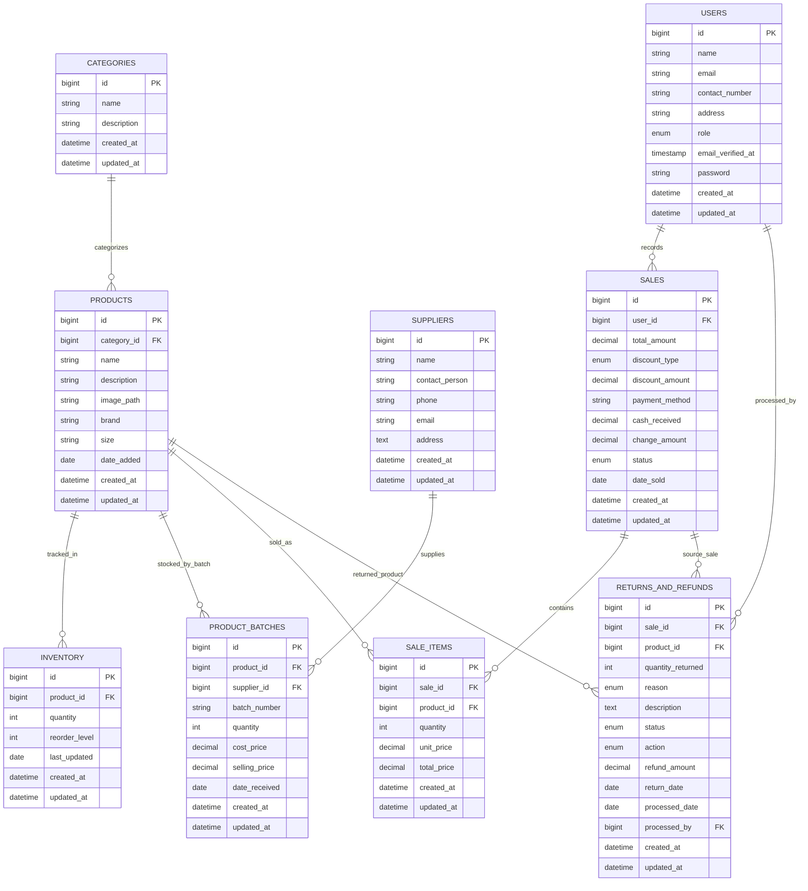

# Boutique POS ERD

This ERD reflects the current business schema based on the latest migrations.

## Notes

- The online ordering tables (online_orders, order_items, customers) are removed by the restructure migration and are not included in the current-state ERD.
- Laravel framework support tables (sessions, cache, jobs, etc.) are excluded to keep this ERD focused on business entities.
