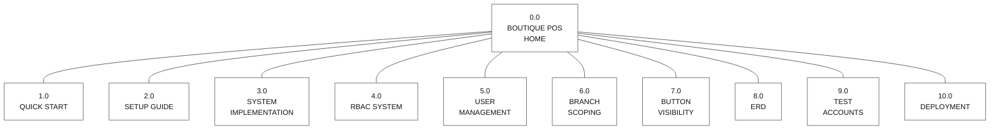
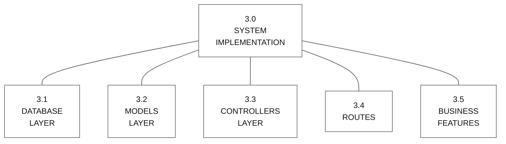
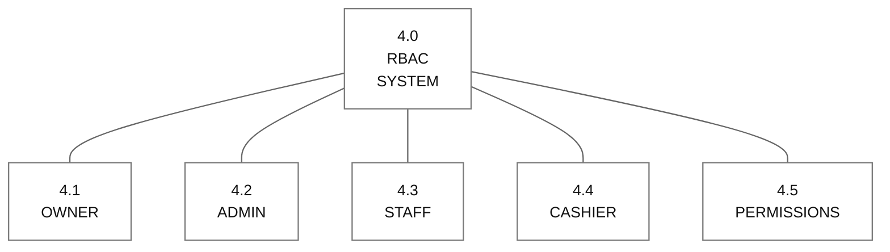
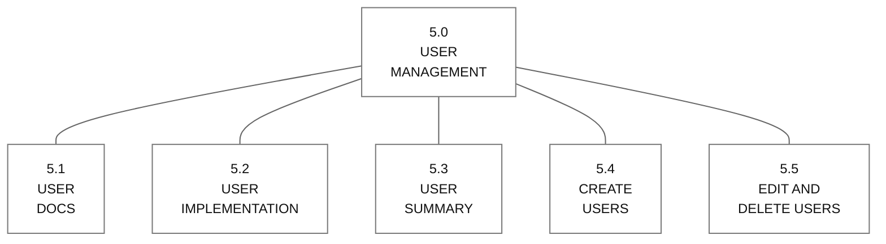
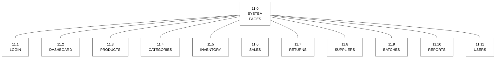
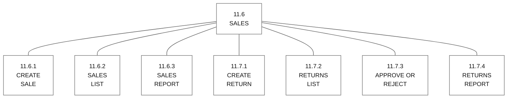
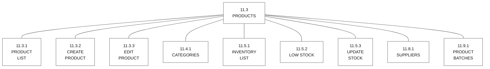

# Visual Table of Contents (VTOC)

This page provides a complete visual map of the Boutique POS project documentation and major system pages, using the same top-down structure as your sample.

## Main Project Map

**Boutique POS Home Page**

Figure V.1.0  
VTOC

## Documentation Modules

**System Implementation Page**

Figure V.1.1  
VTOC

## RBAC System Page

**RBAC System Page**

Figure V.1.2  
VTOC

## User Management Page

**User Management Page**

Figure V.1.3  
VTOC

## System Pages Map

**System Pages**

Figure V.1.4  
VTOC

## Sales and Returns Page

**Sales and Returns Page**

Figure V.1.5  
VTOC

## Inventory and Product Page

**Inventory and Product Page**

Figure V.1.6  
VTOC

## Section Reference

| Code | Section | File or Route |
| --- | --- | --- |
| 0.0 | Boutique POS Home | `README.md` |
| 1.0 | Quick Start | `QUICK_START.md` |
| 2.0 | Setup Guide | `SETUP_GUIDE.md` |
| 3.0 | System Implementation | `SYSTEM_IMPLEMENTATION.md` |
| 4.0 | RBAC System | `RBAC_DOCUMENTATION.md` |
| 5.0 | User Management | `USER_MANAGEMENT_DOCS.md` |
| 6.0 | Branch Scoping | `BRANCH_SCOPING_IMPLEMENTATION.md`, `BRANCH_FILTER_GUIDE.md` |
| 7.0 | Button Visibility | `BUTTON_VISIBILITY_GUIDE.md` |
| 8.0 | ERD | `ERD.md` |
| 9.0 | Test Accounts | `TEST_ACCOUNTS.md` |
| 10.0 | Deployment | `DEPLOYMENT_CHECKLIST.md` |
| 11.1 | Login | `/login` |
| 11.2 | Dashboard | `/dashboard` |
| 11.3 | Products | `/products` |
| 11.4 | Categories | `/categories` |
| 11.5 | Inventory | `/inventory` |
| 11.6 | Sales | `/sales` |
| 11.7 | Returns | `/returns` |
| 11.8 | Suppliers | `/suppliers` |
| 11.9 | Batches | `/batches` |
| 11.10 | Reports | `/reports` |
| 11.11 | Users | `/users` |
